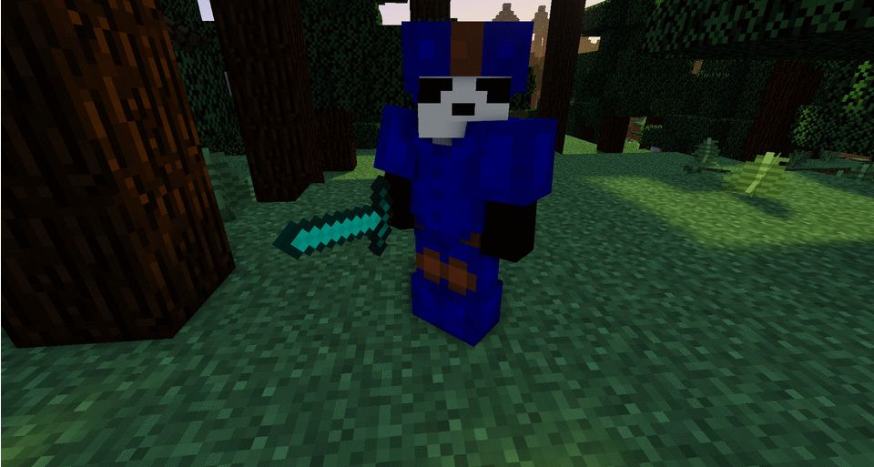

# Battalion #

Rank based PvP plugin for Minecraft servers.

## Ranks ##

Player ranks are split into each of the primary colors in Minecraft. Each rank requires a certain number of points to join. Points are accumulated by killing a player of equal or higher rank. Dying to a player of equal or lower rank will decrease the players rating, die too often and you may drop out of your rank.

There is a decay over time, fully configurable, that affects all players by lowering their position a specified number of points, possibly dropping them out of their rank.

## Rank Armour ##

Armour is completely disabled in the game, everyone is forced to wear the leather armour of their rank. All armour has the characteristics of diamond armour, however lacking any enchants other than those purchased using the in-game economy. Armour enchantments may not benefit players in PvP encounters, but things such as water breathing may be allowed.

